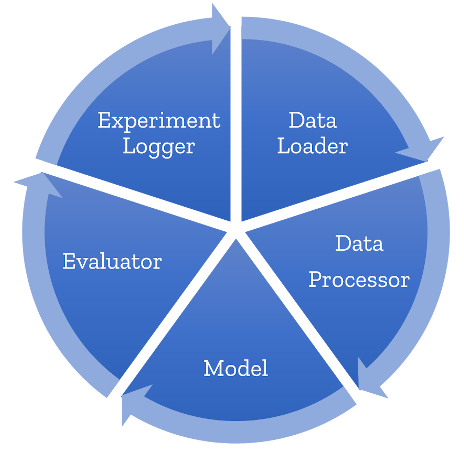

# Fabric ML

Generic experimentation framework for data scientists and data science teams.
It provides a quick starter code for reproducible machine learning.



## TL;DR: What this framework does

- First, it provides functionality for conducting rigorous experimentation: structured, reproducible and robust.
- Then, it builds on top of the awesome
[CookieCutter-DataScience](https://drivendata.github.io/cookiecutter-data-science/) template which takes care of your project structure and python package setup.

It does so by providing these main capabilities:

1. **Collaborate** easily by defining a clear structure for the main building blocks used during model experimentation
2. **Experiment** easily by defining a project template for all Jupyter notebooks
3. **Reproduce** easily by automagically adding experiment logging capabilities to every experiment
4. **Productize** easily by defining code in classes (with defined APIs)

## How to install
To create a new project:

a. Install `cookiecutter`:

- pip:

```
pip install cookiecutter
```

- conda:

```
conda config --add channels conda-forge
conda install cookiecutter
```

b. In an empty folder, generate the project structure:

```sh
cookiecutter git+https://github.com/omri374/FabricML
```
or 
```
python -m cookiecutter https://github.com/omri374/FabricML
```

c. Follow the instructions on the README file in the newly created project.

## Example usage
1. Example 1: Simple classifier on the iris dataset ([ipynb version](samples/iris/notebooks/iris.ipynb), [html version](samples/iris/notebooks/iris.html))

2. Example 2: NER using the `flair` nlp package:
- This notebook shows the full implementation of a Named Entity Recognition problem ([ipynb](samples/ner_sample/notebooks/flair_ner.ipynb), [html](samples/ner_sample/notebooks/flair_ner.html))
- This notebook shows the same, after the modules have been implemented (final outcome) ([ipynb](samples/ner_sample/notebooks/flair_ner_clean.ipynb), [html](samples/ner_sample/notebooks/flair_ner_clean.html)))

## Why use this framework

Machine learning experimentation is a complex process which can take many months, 
and involve multiple team members and stakeholders. 
Once a good model is developed, the process of operationalizing the new model begins, in which we 
develop the model as a software module, maintain it over time 
and constantly re-evaluate it against newly developed versions.

This package structures the experimentation process differently 
by standardizing model development across experiments and team members, 
tracking model results over time, and by turning research outputs into software components 
capable of being integrated into a production system. 

More specifically, here are the main benefits you get by using this framework:

### Clear structure for the main building blocks

- **DataLoader**: Unified code for getting data
- **DataProcessor**: For data preprocessing, feature engineering and postprocessing
- **BaseModel**: scikit-learn like API wrapper for all models
- **Evaluator**: Define your metrics in an explicit and traceable way
- **ExperimentRunner**: Runs an entire cycle, from data loading,
through preprocessing, model fit, predict and evaluate on new data.
In addition, it takes parameters and metrics from all of the above
and stores a unified and reproducible representation of your experiment.

### Project template for all Jupyter notebooks

All notebooks look the same: Get the data, preprocess it, fit a model, evaluate.
Why not make this standardized so you won't have any errors?

### Implicit and full experiment logging

The experiments are structured in a way, that you will always be able to reproduce any experiment,
as code, hyperparams, data versions and metrics are stored using your favorite experiment logger (mlflow or others)

### Production ready project and package structure
This framework is built on top the CookieCutter Data-Science template: 
- docs: <https://drivendata.github.io/cookiecutter-data-science/>
- folder structure: <https://github.com/drivendata/cookiecutter-data-science/#the-resulting-directory-structure>


## Getting started with experimentation

The easiest way to get started is to generate a notebook from a template,
and implement the basic building blocks (loading data, preprocessing, modeling).

The notebook template is a markdown file which can be used to set up new experiments easier. 
The template is a text file so maintaining it on source control is easy.

For an example template, [see this template](<{{ cookiecutter.repo_name }}/notebook_templates/example_template.md>).

To generate a new notebook:

```sh
python generate_notebook.py --name my_new_notebook.ipynb
```
